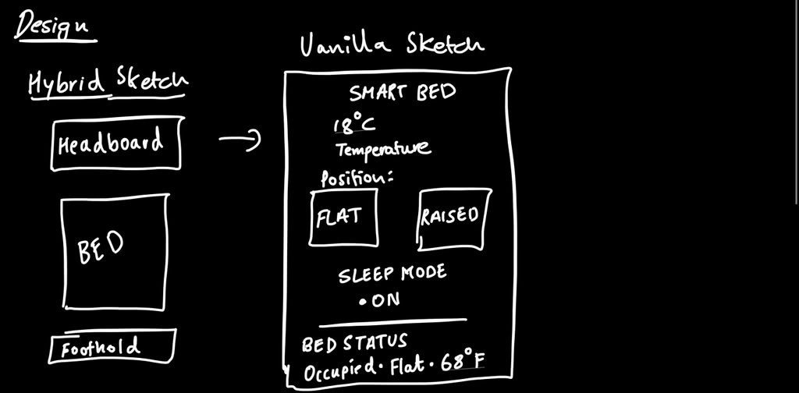
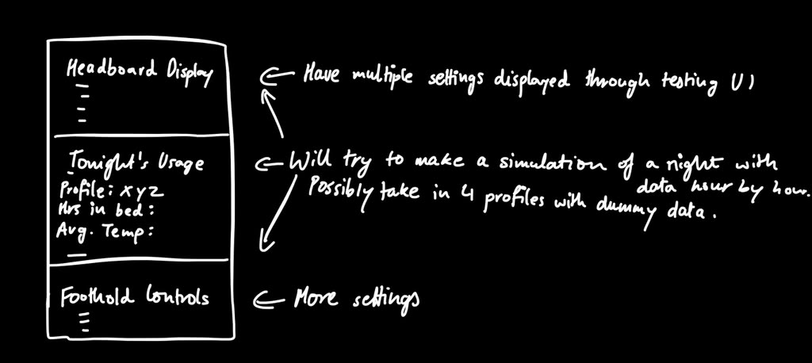

# Project 1: Smart Bed Documentation

**Interface to a Smart Object**  
**Author:** Shivam Sinay Kharangate  
**Course project:** UI2026 Project 1  
**Object:** Smart Bed (digital mock-up)  
**Built with:** Svelte 5 + JavaScript + Vite  

| Link | URL |
|---|---|
| Live application | [https://shivamkgate.github.io/UI2026/](https://shivamkgate.github.io/UI2026/) |
| Source code (GitHub) | [https://github.com/ShivamKGate/UI2026](https://github.com/ShivamKGate/UI2026) |
| Demo video (2–3 min) | [https://github.com/ShivamKGate/UI2026/blob/main/proj1/demo/UI2026-Project1Demo.mp4](https://github.com/ShivamKGate/UI2026/blob/main/proj1/demo/UI2026-Project1Demo.mp4) |

---

## 1. Describing the project

This project is a **digital mock-up** of a **smart bed**: a physical bed made digital with a headboard display and controls, and being smart with sensing of occupancy, temperature, position, and overnight usage.

This mock-up runs in the browser. It is **not** a physical product, it is deployed through GitHub Pages. It lets the user try the interface, simulate lying down or getting up or room cooling, load different sleeper profiles, and run a compressed overnight timeline so the UI’s behavior is clear for design review.

**Multi-surface requirement:** Controls and display are **not** on one flat panel. Status lives on a **headboard display**; interactive controls live at the **footboard**, and a middle sensor visualboard with data populated visually based on profile selected.

*Figure 1. Full page after a night simulation and loading John (Light sleeper). Left = Testing UI; right = Device UI.*

---

## 2. The design work

### 2.1 Affordances and physical properties

A bed is **large**, **heavy**, and it is **fixed** in a room. You cannot pocket it or casually just move it. It **affords lying down** (and sitting) through its horizontal soft surface and clear **head vs foot** orientation.

Relevant properties for the UI that was considered:

- Multi-surface: mattress, headboard, footboard  
- Used often in **low light**, when the user is tired or half-asleep  
- Hands may not be free; tiny precise controls are a poor fit  
- May be shared; privacy matters for what a display shows  

**Design implication:** The idea was to keep the UI simple and readable from the pillow. Put glanceable status on the **headboard**; put intentional controls near the **foot** so they are reachable without hunting for a remote.

### 2.2 Capturing user needs through interviews

Three people outside class were interviewed, which included my family members. They described typical bedtime use verbally, as a physical bed demo was not needed.

**Interview questions**

1. What do you usually do in the last 5 minutes before sleep?  
2. What do you adjust on the bed usually: position, blankets, temp, or the light?  
3. What is annoying about the bed or sleeping setup today?  
4. Would you want the bed to change by itself overnight? Why / why not?  
5. Where would you look for controls: phone, headboard, or on the side of bed?

**What was learned**

They would like **easy position changes**, **overnight comfort with temperature**, and controls usable **while lying down or in the dark**. Light automation is welcome (like for example flatten when asleep, cool overnight) if it stays **quiet and simple**. **Headboard or bed-side** would beat the concept searching for a remote, hence it needs to be integrated within a reachable UI within the bed. 

### 2.3 Smart / sensing assumptions

Feasible “smart” features assumed for this mock-up:

- Occupancy (someone in bed vs empty)  
- Temperature near the bed / room  
- Bed position (flat / raised)  
- Sleep mode on/off (manual or when occupied)  
- Nightly usage: hours in bed, times got up, average temp, % time flat  

### 2.4 User needs → design requirements

| User need | Design requirement |
|---|---|
| See how warm it feels | Display temperature; allow setting it |
| Change posture for reading vs sleep | Flat / Raised controls with clear status |
| Start / end sleep simply | Sleep mode on/off + visible status |
| Bed reacts when getting in / out | Occupancy + Testing UI sensor buttons |
| Use UI while lying down | Simple clusters; readable headboard |
| Understand overnight use | Usage stats + simple SVG charts |
| See a night play out | Run night simulation with night clock |

### 2.5 Sketching and evaluate

Design sketching for this project included:

- Characterizing affordances (above)  
- **3 design challenges** explored with rapid alternatives (10+10 / time-boxed sketching), including: using the bed in the dark; auto vs manual sleep mode; where temperature vs position controls should live  
- **1 vanilla sketch** of the core bed controls and status finalized through the design challenges
- **Hybrid sketch** showing headboard + bed + foothold on the physical object  
- A later wireframe for Device UI panels (headboard display, tonight’s usage, foothold controls) and notes toward night simulation + 4 profiles  

*Figure D1. Hybrid sketch (headboard / bed / foothold) next to the vanilla Smart Bed UI sketch (temperature, flat/raised, sleep mode, bed status).*

*Figure D2. Early Device UI layout: Headboard Display, Tonight’s Usage, and Foothold Controls, with notes about night simulation and four dummy profiles.*

**Vanilla sketch feedback:** They prefer few large controls; want clear occupied/sleep status; also like the idea of overnight cooling without many menus. That feedback pushed the final UI toward clustered footboard controls, a strong “last action” line, and separate Testing buttons for sensors vs Run night.

---

## 3. The project interface in detail

### 3.1 Level 0: The Testing UI and Device UI

The page is split into two regions:

- **Testing UI (left):** project title, name, write-up link, bed placement graphic, Info button, sensor simulation, overnight Run night, and profile loaders  
- **Device UI (right):** what the user would see/use on the bed (headboard display, usage panel, footboard controls)  

*Figure 2. Info button open, explains how Testing UI buttons fake sensors. Also shows room cooling driving temperature down on the Device UI.*

The bed diagram shows **where** the UI sits on the physical object (headboard vs footboard), which would satisfy the multi-surface rule.

### 3.2 Level 1: Basic object UI

**Controls (footboard)**

| Control | Tied to design goal |
|---|---|
| Temperature number input | Comfort: set bed/room temperature |
| Flat / Raised buttons | Position for sleep vs reading |
| Sleep mode on/off button | Simple start/end of sleep |

**Indicators (headboard)**

| Indicator | Purpose |
|---|---|
| Night clock | Time during overnight simulation |
| Occupancy | Empty vs occupied |
| Temperature | Current comfort reading |
| Position | Flat or raised |
| Sleep mode | On / off |
| Sleep sessions today | Light usage count |
| Last action | Immediate feedback after any change |

**Design choices:** Display is clustered on the headboard; controls are clustered by activity (comfort / position / sleep) at the footboard. Every meaningful action updates **Last action**.

*Figure 3. Testing button “Person lying down”: Device UI shows occupied, flat, sleep mode on, and last action from sensors.*

*Figure 4. “Person getting up” clears occupancy, turns sleep mode off, and raises the bed.*

*Figure 5. Footboard controls in use: temperature set manually; sleep mode toggled; last action reflects the change.*

### 3.3 Option 3: Usage / sensor data and four profiles

The Device UI includes **Tonight’s usage**: hours in bed, times got up, average temperature, and % time flat: as text **and** simple SVG bars/dots so different sleep patterns are easy to compare.

**Why this is valuable:** Users can see at a glance whether a night was short/restless vs long/deep, and how cool the room felt without opening a separate analytics app.

**Four profiles** (loaded from Testing UI):

| Profile | Type | What it emphasizes |
|---|---|---|
| John | Light sleeper | Moderate hours, some wakeups |
| Luke | Deep sleeper | Long night, 0 wakeups, mostly flat |
| Mary | Restless | Short night, many wakeups, less time flat |
| Stark | Cool-room sleeper | Cooler average temp, solid flat % |

*Figure 6. Luke (Deep sleeper): 8.5 hours, 0 wakeups, 95% flat: bars and dots update with the profile.*

*Figure 7. Mary (Restless): 5 hours, 5 wakeups, 40% flat: clearly different from Luke.*

*Figure 8. Stark (Cool-room sleeper): cooler average temp (15°C) with high time-flat percentage.*

### 3.4 Option 4: Overnight simulation over time

**Run night / Stop night** in the Testing UI plays a short preset schedule (about 1 second per step): lie down → cool → cooler → brief sit-up → back to sleep → morning warm-up → get up.

While it runs, the Device UI updates live: **night clock**, occupancy, temperature, position, sleep mode, and last action.

*Figure 9. Mid-simulation: button shows “Stop night,” night clock is 3:45 AM, last action “Night: back to sleep,” bed occupied/flat/sleep on.*

---

## 4. How it was implemented

| Piece | Detail |
|---|---|
| Framework | **Svelte 5** (runes: `$state`) |
| Bundler | **Vite** (`npm run dev`, `npm run build`) |
| Main UI | Single component: [`src/App.svelte`](src/App.svelte) |
| Global theme | [`src/app.css`](src/app.css): black + neon purple |
| Fonts | Syne (headings) + Outfit (body) via Google Fonts in `index.html` |
| Charts | Plain **SVG** (no chart library) |
| Hosting | GitHub Pages via Actions workflow building `proj1/dist` |
| Base path | `base: '/UI2026/'` in `vite.config.js` |

**Code structure (simple):**

- Reactive state for bed + stats + night simulation  
- Helper functions: `selectProfile`, `toggleNight`, sensor buttons (`personLiesDown`, etc.)  
- Markup split into `#testing-ui` and `#device-ui`  
- Scoped CSS for layout, cards, buttons, and chart styling  

No backend and no real sensors: Testing UI **simulates** what sensors would report.

---

## 5. Demo video

A screen-capture demo with voiceover is included:

**[Watch / download: demo/UI2026-Project1Demo.mp4](demo/UI2026-Project1Demo.mp4)**

The video covers: project name and author, Testing vs Device split, basic controls, profile loading (Option 3), and Run night (Option 4).

---

## 6. Future work

- Optional **Option 1**-style sleep schedule editor as I have some fun ideas there that I could have implemented.
- Optional **Option 2** phone companion for remote presets too.
- Persist usage stats across browser sessions  
- Stronger accessibility pass (focus order, larger targets)  

---

## 7. AI documentation

**AI** was used during implementation and documentation drafting for:

- Assistance in code editing and positioning of the components through the levels, implementing the fake data with profiles and sensor visuals, finally also with implementing the CSS palette after provided input.
- Help structure this write-up and place screenshots  

**Human decisions stayed with the author (me):** smart bed was chosen as the object by me; interview framing; choosing **Option 3 + Option 4**; profile names/types; keeping the UI simple; recording the demo; taking screenshots; and final wording for the course submission.

---

## 8. Links (submission checklist)

- **Live app:** https://shivamkgate.github.io/UI2026/  
- **GitHub:** https://github.com/ShivamKGate/UI2026 (project under `proj1/`)  
- **This documentation:** [`DOCUMENTATION.md`](DOCUMENTATION.md) in the repo  
- **Demo video:** [`demo/UI2026-Project1Demo.mp4`](demo/UI2026-Project1Demo.mp4)  

---

## Appendix: Screenshot index

| File | What it shows |
|---|---|
| `191257` | Overview: John after night finished |
| `191315` | Person lying down (Mary stats) |
| `191322` | Person getting up |
| `191334` | Info open + room cooling |
| `191343` | Run night mid-simulation (3:45 AM) |
| `191354` | Luke deep sleeper |
| `191400` | Mary restless profile |
| `191405` | Stark cool-room profile |
| `191417` | Manual footboard / sleep toggle |
